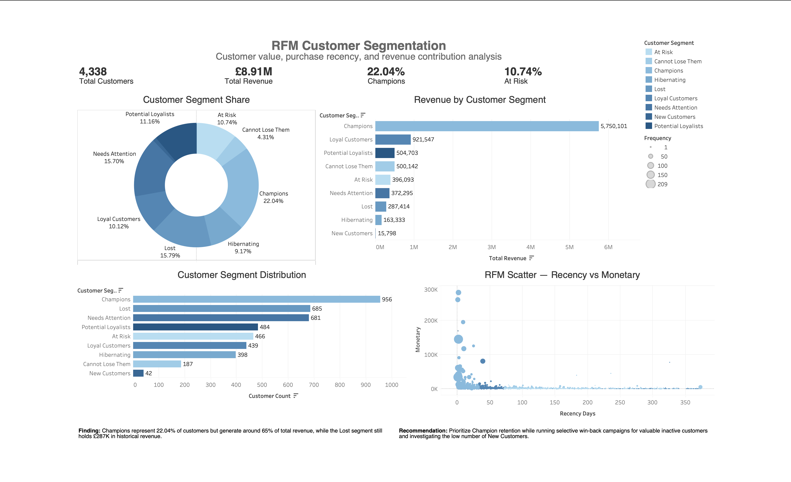
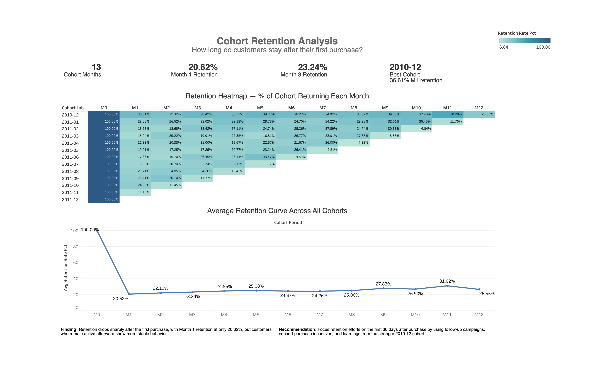
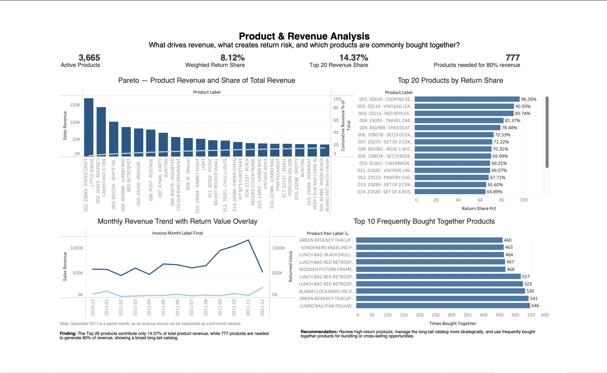

# Online Retail Customer Revenue Analytics

## Project Overview

This project analyzes customer behavior, retention, and product revenue performance using the Online Retail II dataset. The goal is to identify high-value customer segments, understand repeat-purchase behavior, and evaluate product-level revenue concentration and return risk.

The project uses PostgreSQL on Neon for data cleaning and transformation, SQL for analytical modeling, Google Colab for upload/export workflow, and Tableau for dashboard visualization.

## Data Source

The dataset used in this project is the Online Retail II dataset, obtained from Kaggle. The dataset contains transactional retail data including invoice number, product code, product description, quantity, invoice date, price, customer ID, and country.

Dataset source: [https://www.kaggle.com/datasets/tunguz/online-retail-ii]


## Business Questions

1. Which customer segments generate the most revenue?
2. How well does the business retain customers after their first purchase?
3. Which products drive revenue, create return risk, and are frequently bought together?

## Tools Used

* PostgreSQL on Neon
* Google Colab
* SQL
* Tableau Public Desktop
* GitHub

## Data Pipeline

The project follows a layered analytics workflow:

1. Raw CSV data was uploaded to PostgreSQL using Google Colab.
2. A raw table was created in the `raw` schema.
3. A cleaned view was created in the `clean` schema to standardize dates, revenue, customer IDs, and transaction status.
4. Validation checks were performed to inspect row counts, missing customers, cancelled invoices, date range, and country-level revenue.
5. Tableau-ready analytical views were created in the `mart` schema.
6. Final CSV exports were loaded into Tableau to build three dashboards.

## Dashboard 1 — RFM Customer Segmentation



**Finding:** Champions represent 22.04% of customers but generate around 65% of total revenue, while the Lost segment still holds £287K in historical revenue.

**Recommendation:** Prioritize Champion retention while running selective win-back campaigns for valuable inactive customers and investigating the low number of New Customers.

## Dashboard 2 — Cohort Retention Analysis



**Finding:** Retention drops sharply after the first purchase, with Month 1 retention at only 20.62%, but customers who remain active afterward show more stable behavior.

**Recommendation:** Focus retention efforts on the first 30 days after purchase by using follow-up campaigns, second-purchase incentives, and learnings from the stronger 2010-12 cohort.

## Dashboard 3 — Product & Revenue Analysis



**Finding:** The Top 20 products contribute only 14.37% of total product revenue, while 777 products are needed to generate 80% of revenue, showing a broad long-tail catalog.

**Recommendation:** Review high-return products, manage the long-tail catalog more strategically, and use frequently bought together products for bundling or cross-selling opportunities.

## SQL Skills Demonstrated

* Schema design using `raw`, `clean`, and `mart` layers
* Data cleaning with SQL views
* Date parsing and month-level transformation
* Customer-level aggregation
* RFM scoring using `NTILE()`
* Cohort retention analysis using CTEs and date logic
* Product Pareto analysis using window functions
* Return-risk analysis using conditional aggregation
* Frequently bought together analysis using self-joins
* Tableau-ready mart view creation

## Project Structure

```text
online-retail-customer-revenue-analytics/
│
├── data/
│   └── tableau_exports/
│
├── notebooks/
│   └── upload_data_online_retail_to_neon.ipynb
│
├── sql/
│   ├── 01_create_raw_table.sql
│   ├── 02_create_cleaned_view.sql
│   ├── 03_validation_checks.sql
│   └── 04_create_tableau_mart_views.sql
│
├── tableau/
│   ├── workbook/
│   │   └── online_retail_customer_revenue_analytics.twbx
│   └── screenshots/
│       ├── dashboard_1_rfm_customer_segmentation.png
│       ├── dashboard_2_cohort_retention_analysis.png
│       └── dashboard_3_product_revenue_analysis.png
│
└── README.md
```

## Notes and Limitations

* Rows without Customer ID were excluded from customer segmentation and cohort retention analysis because they cannot be reliably linked to customer behavior.
* Cancelled invoices and negative quantities were treated as return or cancellation indicators.
* The dataset does not include a product category field, so product analysis was performed at product level using stock code and description.
* December 2011 is a partial month, so the monthly revenue drop at the end of the period should not be interpreted as a full-month decline.
* The analysis is based on historical transaction data and should be interpreted as descriptive analytics, not causal proof.

## Outcome

This project demonstrates how SQL and Tableau can be combined to transform raw retail transaction data into business-ready insights on customer value, retention behavior, revenue concentration, product return risk, and cross-selling opportunities.
